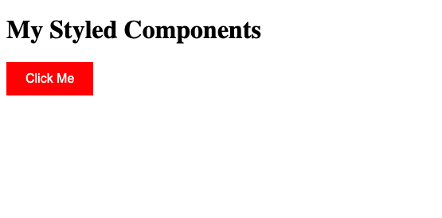
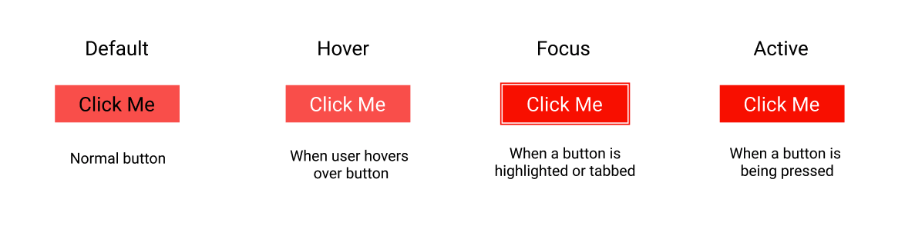
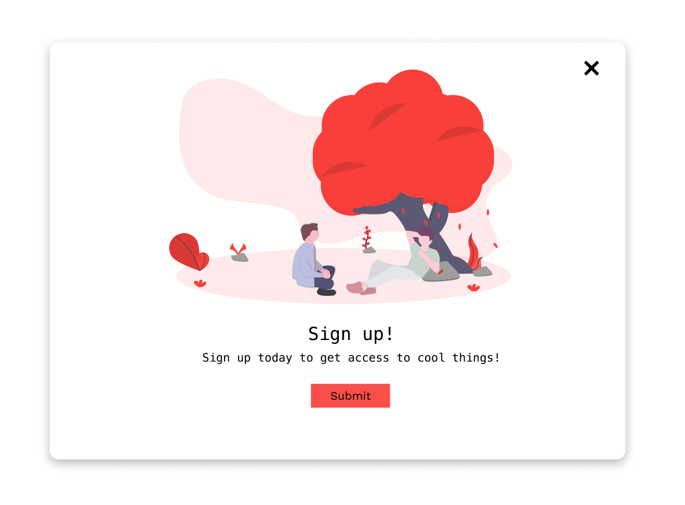

# React Styled-Components


## Why use styled-components?

[Styled Components](https://styled-components.com/) is a Javascript library that helps keep the concerns of styling and element architecture separate and makes components more readable, overall. Furthermore, when you have components that rely on JavaScript for their style, Styled Components gives control of those states back to CSS instead of using a multitude of conditional class names.

### Some drawbacks of CSS:

#### 1. Specificity

In css, the most specific style wins. This is problematic because styles are slowly becoming decentralized and hard to remove or update.

A lack of knowledge of CSS specificity leads to a lot of `!important`s. Which is a lazy way of overriding specificity.

```html

// For example

<style>

p {
    color: red !important;
}

#thing {
    color: green;
}

</style>

<p id="thing">I will be RED.</p>

```

In general, there are a lot of ways of writing CSS which can be difficult when collaborating in a team.

#### 2. CSS Naming Architectures

CSS naming architectures were created to superficially scope CSS styling

BEM (or Block Element Modifier) is the most notable naming architecture.

They're simply a naming convention but won't prevent leaked styling.

```css

.shopping-cart-item {
    color: blue;
}

.shopping-cart-item-item--out-of-stock {
    color: red;
}

```

### CSS pre-processors

CSS pre-processers like SASS and LESS provide styling capabilities such as nesting, mixins, and more which allow more control over how our CSS styles are applied.

```css

.shopping-cart {
    &__item {
        color: blue;
    }
    &--selected {
        color: red;
    }
}

```

## CSS in JS

Local Inline Styles are useful for specificity, but are limited in capabilities (it's only a subset of CSS). They don’t have media queries, keyframes, pseudo-selectors, etc.

For example:

```javascript

    // Vanilla JS
    let element = document.createElement('div');
    element.setAttribute('style', 'color: red; padding: 20px;')

    // React
    <Component
        style={{
            color: "red",
            padding: "20px",
            }}
    />

```


With Styled-Components, JavaScript is used to style our components. When the components are parsed, CSS is generated and attached to the DOM. The CSS used in styled is much more capable than inline styles, allowing for nesting, mixins, and other advanced usage (but not as powerful as a CSS pre-processor).

```javascript

import styled from 'styled-components'

const Button = styled.button`
  background: transparent;
  border-radius: 3px;
  border: 2px solid palevioletred;
  color: palevioletred;
  margin: 0 1em;
  padding: 0.25em 1em;
`

```

## Code-Along

### Installation 

First we're going to want to install the `styled-components` dependency.

```
npm i styled-components
```

### The Basic Setup

The next thing we will do is make a directory for our components

```
mkdir src/components && cd src/components
```

From here let's create our first styled-component, a Button (creative, I know)

```
touch Buttons.js
```

In our `Buttons.js`, we will import styled-components and define our first button, a Primary Button.

```javascript
// Buttons.js
import styled from 'styled-components';

const PrimaryButton = styled.button`
    // CSS / SCSS goes in here
    background-color: red;
    border: none;
    color: white;
    padding: 12px 24px;
    font-size: 1rem;
`

export default PrimaryButton;

```

In our `App.js`, we will import the PrimaryButton and render it in our App.

```javascript
// App.js
import React from 'react';
import PrimaryButton from './components/Buttons';

function App() {
  return (
    <div>
      <h1>My Styled Components</h1>
     <PrimaryButton>Click Me</PrimaryButton>
    </div>
  );
}

export default App;

```

You should see something like this rendered in your browser:



### Inheritance with Styled-Components

We can refactor our `Buttons.js` to dry our code when creating more button variations. We will create a base `Button` component that all specific buttons will inherit the styled properties of.

```javascript
// Buttons.js
...

// The Base Button Component
const Button = styled.button`
    padding: 12px 24px;
    font-size: 1rem;
    border-radius: 2px;
    min-width: 100px;
    cursor: pointer;
    font-family: "Menlo", monospace;
`
// PrimaryButton inherits Button
const PrimaryButton = styled(Button)`
    // CSS / SCSS goes in here
    background-color: red;
    border: none;
    color: white;
`

```

### Global Styles

### Adding more button states with nesting



Next we will be implementing our various Button states. The correct properties will usually be provided to you through a brand guide or a design system by a designer. If you're a unicorn and designed the button states yourself, you can retrieve the colors, padding, and font-sizes yourself from Figma or any conventional design tool.

```javascript
// Buttons.js
...

const primaryColor = '#FF5757';
const hoverColor = '#FF4646';
const activeColor = '#FF0000';

const textOnPrimary = '#000000';
const textOnPrimaryInverted = '#ffffff';

const disabled = '#B1B1B1';
const disabledText = '#3E3D3D';

const PrimaryButton = styled(Button)`
    // CSS / SCSS goes in here
    background-color: ${primaryColor};
    border: none;
    color: ${textOnPrimary};

    &:hover {
        background-color: ${hoverColor};
        color: ${textOnPrimaryInverted};
    }

    &:focus {
        background-color: ${activeColor};
        color: ${textOnPrimaryInverted};
        outline: 2px solid ${activeColor};
        outline-offset: 1px;
    }

    &:active {
        background-color: ${activeColor};
        color: ${textOnPrimaryInverted};
    }

    &:disabled {
        background-color: ${disabled};
        color: ${disabledText};
        cursor: not-allowed;
    }
`

```

### Additional Button Variations

Modifiers in styled-components allow us to add additional modifications to our styled-components. For the example of the button, we will add two modifiers for bigger and smaller Primary Buttons.

First install the `styled-components-modifiers` package  

```
    npm i styled-components-modifiers
```

After this, we will go ahead and define our `BUTTON_MODIFIERS`, which is a configuration object of functions that return CSS styled strings.

```javascript
// Buttons.js
import styled from 'styled-components';
import { applyStyleModifiers } from 'styled-components-modifiers';

const BUTTON_MODIFIERS = {
    small: () => `
      font-size: 0.8rem;
      padding: 8px;
    `,
    large: () => `
      font-size: 1.5rem;
      padding: 16px 25px;
    `,
    warning: () =>  `
      background-color: #F2DC12;
      color: black;

      &:hover, &:focus, &:active {
          background-color: #F2DC12;
          color: black;
          outline: none;
      }
    `
}

...

```

We will then apply the modifiers <strong>in the last line of our defined PrimaryButton</strong>, such that it is not overridden by any of the defined styles.

```javascript
// Buttons.js

...

const PrimaryButton = styled(Button)`
    // CSS / SCSS goes in here
    background-color: ${primaryColor};
    border: none;
    color: ${textOnPrimary};

    &:hover {
        background-color: ${hoverColor};
        color: ${textOnPrimaryInverted};
    }

    ...

    ${applyStyleModifiers(BUTTON_MODIFIERS)}
`

export default PrimaryButton;

```

In `App.js`, we are then able to utilize modifiers like so:

```javascript

    <PrimaryButton modifiers="large">A Large Button</PrimaryButton>

    <PrimaryButton modifiers="small">A Small Button</PrimaryButton>

    <PrimaryButton modifiers={["large", "warning"]}>A Large Warning Button</PrimaryButton>

```

### Building a Modal



